# FIAP - Faculdade de Informática e Administração Paulista

<p align="center">
<a href= "https://www.fiap.com.br/"></a>
</p>

<br>


# Projeto: fiap_gs1

## Atividade em Grupo: FIAP - 1TIAOB - 2025/1 - Fase4 GS1

## 👨‍🎓 Integrantes: 
- <a href="">Alice C. M. Assis - RM 566233</a>
- <a href="">Leonardo S. Souza - RM 563928</a>
- <a href="">Lucas B. Francelino - RM 561409</a> 
- <a href="">Pedro L. T. Silva - RM 561644</a> 
- <a href="">Vitor A. Bezerra - RM 563001</a>

## 👩‍🏫 Professores:
### Tutor(a) 
- <a href="proflucas.moreira@fiap.com.br">Lucas Gomes Moreira</a>
### Coordenador(a)
- <a href="profandre.chiovato@fiap.com.br">André Godoi Chiovato</a>

## 🌍 Escolha do Evento Extremo e Base de Dados Utilizada

Para o desenvolvimento deste projeto, o grupo escolheu focar no desastre natural ocorrido em 29 de abril de 2024: Enchente no Brasil. Este evento extremo foi selecionado por sua relevância e impacto significativo nas regiões afetadas, tornando-se um caso de estudo ideal para a aplicação de técnicas de previsão e monitoramento.

Como base de dados para o treinamento e validação do modelo de IA, utilizamos as informações disponibilizadas gratuitamente pelo site disasterscharter.org. Essa plataforma reúne dados reais de desastres globais, incluindo imagens de satélite, relatórios técnicos e registros oficiais monitorados por agências internacionais. O uso dessas informações garante que o modelo tenha acesso a dados confiáveis e atualizados para a construção de previsões mais precisas e eficazes.

## 📜 Descrição

## Projeto: Neura5: Agente de IA para Comunicação Emergencial em Desastres

Confira o vídeo de apresentação do projeto clicando no link(imagem) abaixo:

[](https://www.youtube.com/watch?v=STebZkIM680)

## Introdução

Nos últimos anos, o IPCC documentou que eventos de precipitação intensa aumentam em cerca de **7% a cada 1 °C de aquecimento**, resultando em inundações mais severas e frequentes. Esse agravamento se reflete em dados regionais: entre 2000 e 2023, a **EM-DAT registrou 505 desastres hidrológicos** na América do Sul, com **mais de 10 694 óbitos**. No Brasil, as enchentes de janeiro de 2020 **deslocaram entre 30 000 e 46 500 pessoas** e causaram pelo menos **70 mortes**.

Ao mesmo tempo, órgãos de resposta como a **Defesa Civil e o Corpo de Bombeiros enfrentam limitações logísticas, escassez de recursos e déficit de pessoal**, especialmente em áreas urbanas densas. Nessa situação, a comunicação emergencial — essencial para orientar evacuações preventivas — torna-se imprescindível, pois **informações claras e precisas podem reduzir significativamente o número de vítimas**. A rápida propagação de notícias falsas em redes sociais torna ainda mais urgente dispor de meios confiáveis, eficazes e ágeis de divulgação.

Diante desse contexto, desenvolvemos um **agente de inteligência artificial** que incorpora **um modelo de previsão de enchentes** treinado com dados históricos e leituras de sensores, além de **gerar automaticamente conteúdos informativos e alertas**. O objetivo é **otimizar tempo e recursos das equipes de emergência**, garantindo que orientações essenciais cheguem de forma rápida e eficaz à população em risco. Adicionalmente, propomos futuramente a **criação de um aplicativo móvel** que incluirá funcionalidades de suporte a buscas e resgates em situações de desastre**, como **monitoramento de áreas de risco**, **detecção de perda de sinal suspeita** e **notificação automática de autoridades**.

## O Problema

O principal desafio consiste em estabelecer uma comunicação eficiente e assertiva, capaz de rivalizar com a rapidez das redes sociais e de combater a proliferação de informações falsas. Além disso, caso a mensagem não seja apresentada de forma atrativa, é provável que parcela significativa da população não a leia, comprometendo ações de segurança essenciais.

Em situações de crise, a população necessita de **orientações claras** e imediatas sobre procedimentos de autoproteção, locais de abrigo e medidas a serem adotadas para garantir a segurança individual e coletiva.

Portanto, é imprescindível que a comunicação seja **visualmente impactante**, utilizando imagens e recursos gráficos que transmitam a urgência dos fatos e as instruções necessárias de maneira rápida e de fácil compreensão. Muitos cidadãos podem não ter acesso a textos longos ou apresentar dificuldades de leitura em momentos de estresse. Por esse motivo, o uso de elementos visuais apropriados torna-se fundamental para ampliar o alcance e a eficácia das mensagens.

## MVP da Solução Proposta

**Desenvolvemos um Agente de Inteligência Artificial** voltado para a **geração automática de publicações e imagens informativas** que possam ser utilizadas em tempo real pelos canais de comunicação da **Defesa Civil** e do **Corpo de Bombeiros**. Essa solução atua como **suporte operacional**, produzindo conteúdos **em tempo real** fundamentados em **dados concretos sobre desastres em curso ou iminentes**. O principal objetivo é **aumentar a velocidade e a precisão na divulgação de alertas e orientações** à população em regiões de risco.

As funcionalidades principais do agente incluem:

- **Geração de posts informativos e alertas**: Utilizando **dados captados por sensores ambientais** e **previsões meteorológicas**, o agente elabora **mensagens claras e objetivas** sobre o nível de risco, orientações de segurança e medidas preventivas.
- **Criação de imagens ilustrativas**: Para reforçar o **impacto visual**, o sistema gera **imagens** que permitem à população **compreender rapidamente a gravidade da situação** e as ações recomendadas.
- **Integração com APIs de previsão do tempo**: O agente consulta **serviços externos de meteorologia** para obter **informações atualizadas sobre condições climáticas**, essenciais para **antecipar eventos adversos**.
- **Modelo preditivo de enchentes**: Baseado em **dados históricos, leituras atuais de sensores e variáveis ambientais**, o sistema emprega um **modelo de IA treinado pelo grupo** para **estimar a probabilidade de ocorrência de enchentes** em regiões específicas.

Dessa forma, o agente oferece um **conjunto de ferramentas** que aprimoram significativamente a **capacidade de comunicação das equipes de emergência**, permitindo que a população seja bem informada e consiga evitar incidentes graves com antecedência.

## Tecnologias Utilizadas

- **Machine Learning em Python:** Análise de dados ambientais e geração contextual de mensagens de alerta.

- **ESP32 com sensor ambiental:** Coleta de dados locais (ex.: nível de água) para criar posts baseados em dados em tempo real.

- **Base de dados reais:** Utilização de informações da plataforma [disasterscharter.org](https://disasterscharter.org), que reúne imagens de satélite e relatórios globais sobre desastres. Para treinamento do modelo de IA e criação de prova de conceito, foi utilizado o dataset fornecido pela Agência Nacional de Águas e Saneamento Básico (ANA), disponível no seguinte [link](https://github.com/anagovbr/hidro-dados-estacoes-convencionais/tree/main).

- **Banco de Dados:** Armazenamento e organização de mensagens geradas, registros de risco e históricos.

- **Streamlit:** Desenvolvimento de um dashboard interativo para visualização e gestão dos dados, permitindo que as equipes de emergência acessem rapidamente as informações geradas pelo agente.

- **API de previsão do tempo:** Integração com serviços meteorológicos para fornecer dados atualizados sobre condições climáticas, essenciais para a geração de alertas precisos.

- **Wokwi:** Simulação do ESP32 para monitoramento de condições ambientais, possibilitando a criação de posts informativos baseados em dados reais.

- **FAST API:** Criação de uma api básica para salvar os dados das leituras geradas pela simuação do Wokwi

## Resultados Esperados

- Aumento significativo da **agilidade e eficácia na comunicação** de riscos e procedimentos de segurança;
- **Evacuação mais rápida** e coordenada das comunidades ameaçadas;
- Redução da necessidade de ações logísticas de alto custo e complexas em situações com alta demanda por recursos;
- Suporte prático às operações de campo com **alertas visualmente otimizados** e de fácil replicação;
- Ferramenta expansível para campanhas preventivas e treinamentos.

---

## Upgrades para o Futuro
Com o objetivo de tornar o agente cada vez mais eficiente e relevante em situações de emergência, foram identificadas diversas possibilidades de evolução da solução desenvolvida:

- **Geração de áudio e vídeo:** A expansão do agente para criar conteúdos multimídia, como vídeos curtos e mensagens de voz, pode ser mais eficaz em alcançar públicos diversos. Apesar disso, devido a limitações orçamentárias, a versão inicial se concentra em posts estáticos e imagens. Ainda assim, o grupo utilizou a IA VEO3 para produzir vídeos da apresentação, demonstrando o potencial da ferramenta para futuros desdobramentos.

- **Integração com sistemas de alerta:** Conectar o agente a plataformas de alerta em massa — como sirenes comunitárias, SMS e aplicativos de mensagens — pode garantir que as informações cheguem rapidamente à população em risco, ampliando o alcance das comunicações.

- **Análise de sentimento e feedback:** Implementar mecanismos de análise de sentimento nas redes sociais e nas interações com o agente permitirá entender melhor como a população reage às mensagens, possibilitando ajustes em tempo real nas estratégias de comunicação.

- **Melhoria do modelo de previsão de enchentes:** Com a incorporação de dados adicionais (como dados meteorológicos em tempo real e imagens de satélite) e feedback direto das equipes de emergência, o modelo pode ser continuamente aperfeiçoado, aumentando a precisão das previsões.

- **Análise de dados históricos:** Capacitar o agente para estudar dados históricos de desastres naturais pode ajudar na identificação de padrões, melhorando a antecipação de riscos e o planejamento de campanhas informativas futuras.

- **Expansão para outras áreas:** A arquitetura do agente pode ser adaptada para atuar em outras crises, como pandemias, surtos de doenças, incêndios florestais ou acidentes tecnológicos, ampliando sua utilidade como ferramenta de comunicação pública.

- **Localização e personalização:** Permitir que o agente gere conteúdos personalizados conforme a localização do usuário é uma evolução importante. Com isso, mensagens podem ser adaptadas para refletir a gravidade da situação em cada região, aumentando a relevância e eficácia das orientações.

## (IR ALÉM) 🚀 Próximos Passos e Visão Futura: Expansão para Aplicativo Móvel

Além dos upgrades para o futoro anteriormente citado, visando ampliar ainda mais o impacto e a eficácia da solução desenvolvida, propomos a evolução do projeto para um aplicativo móvel robusto e proativo. O objetivo é ir além da comunicação reativa, oferecendo um sistema de monitoramento individualizado e preditivo, voltado à prevenção de desaparecimentos em cenários de desastre. A ideia é ir além da comunicação passiva e reativa, oferecendo uma camada adicional de proteção à vida humana por meio de análise preditiva, geolocalização e inteligência de rede.

**🚀 Visão Geral**

O aplicativo atua de forma proativa ao:

- Monitorar a localização do usuário em tempo real;
- Validar múltiplas fontes de risco e alertas oficiais;
- Detectar padrões suspeitos de perda de sinal celular;
- Acionar automaticamente as autoridades se todos os critérios forem atendidos.

**🔍 Funcionamento Técnico**

O sistema baseia-se em três etapas principais de verificação simultânea:

1. Monitoramento de Área de Risco

- Verifica se o usuário se encontra em uma região georreferenciada de risco (enchentes, queimadas, deslizamentos, etc.);
- Consulta bases cartográficas oficiais e dados meteorológicos em tempo real.

2. Confirmação de Desastre em Andamento
Integra dados de fontes confiáveis como:

- Defesa Civil
- INMET
- Alertas do governo

Valida se há evento ativo na região monitorada.

3. Análise Inteligente da Perda de Sinal
Parceria com operadoras nacionais para detectar:

- Perda de sinal considerada normal (bateria, desligamento manual, modo avião);
- Perda de sinal suspeita (dano por água, queimaduras, impacto físico, ausência de sinal em área com cobertura);
- Utilização de metadados e padrões da rede em conformidade com a LGPD.

**⚠️ Acionamento Automático**

Se as três condições forem verificadas simultaneamente, o sistema:

✅ Detecta o usuário em uma área de risco ativa

✅ Confirma a ocorrência de desastre na região

✅ Identifica uma perda de sinal anormal

➡️ Aciona automaticamente as autoridades competentes, enviando:

- Última localização registrada;
- Horário e tipo de perda de sinal;
- Dados contextuais sobre o evento natural detectado.

**💡 Impacto Esperado**

Aumento da eficiência no resgate de desaparecidos;

- Redução do tempo de resposta das autoridades;
- Maior eficácia nas buscas;
- Diminuição no número de vítimas não localizadas;
- Ampliação da proteção a populações vulneráveis;
- Suporte direto às operações de campo.

**📈 Futuras Expansões**

- Integração com alertas via SMS, sirenes locais e apps oficiais;
- Histórico offline de alertas, rotas de fuga e pontos seguros;
- Modo "compartilhar localização" com contatos de confiança;
- Painel administrativo para acompanhamento por equipes de resgate.

**🛡️ Conformidade e Privacidade**

Todos os dados tratados seguem a Lei Geral de Proteção de Dados (LGPD).

- Os dados de localização são coletados apenas com consentimento do usuário.
- Nenhuma informação pessoal é exposta ou comercializada.
- Os metadados utilizados para análise de sinal são processados de forma anonimizada, focando exclusivamente em identificar situações de risco.

**🤝 Integração com a Solução de IA**

Este aplicativo compõe uma segunda camada tecnológica no ecossistema proposto pelo grupo:

Enquanto o agente de IA se encarrega da comunicação massiva,

O app móvel foca em ações individuais e automatizadas de resposta emergencial,
trabalhando de forma complementar e coordenada.

---

## Sobre o projeto

O projeto foi desenvolvido com foco em usabilidade fácil e intuitiva, permitindo que as equipes de emergência possam gerar e compartilhar informações rapidamente, mesmo sob pressão. A interface do dashboard foi projetada para ser simples e direta, priorizando a visualização clara dos dados e a geração rápida de posts informativos.

### 1️⃣ Circuito de sensores

<p align="center">
  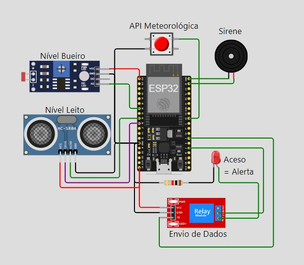
</p>

O grupo desenvolveu um circuito de sensores utilizando o ESP32, que coleta dados ambientais em tempo real e executa ações automáticas de alerta. O funcionamento do sistema está detalhado no arquivo [sketch.cpp](src/wokwi/src/sketch.cpp), que implementa toda a lógica de leitura dos sensores, tomada de decisão e comunicação com a API.

#### Componentes do circuito

- **LDR (Sensor de luminosidade):** Simula o nível de água do bueiro, conectado ao pino analógico 32 (`#define LDR_PIN 32`).
- **HC-SR04 (Sensor ultrassônico):** Mede a distância até a superfície da água (leito do rio), usando os pinos 25 (ECHO) e 26 (TRIG).
- **Botão:** Simula a resposta de uma API meteorológica, conectado ao pino 18.
- **LED:** Indica o envio de dados e alerta de níveis críticos, no pino 2.
- **Relé:** Aciona uma bomba d'água em caso de alerta, no pino 4.
- **Buzzer:** Emite alerta sonoro quando níveis críticos são detectados, no pino 23.

#### Funcionamento do código

1. **Definição dos pinos e configuração inicial:**
   Os pinos dos sensores e atuadores são definidos no início do código:
   ```cpp
   #define LDR_PIN      32
   #define RELAY_PIN    4
   #define LED_PIN      2
   #define BUTTON_API   18
   #define ECHO_PIN     25
   #define TRIG_PIN     26
   #define BUZZER_PIN   23
   ```
   No `setup()`, cada pino é configurado conforme sua função (entrada ou saída), e o Wi-Fi é conectado:
   ```cpp
   void setup() {
     // ...configuração dos pinos...
     conectaWiFi();
   }
   ```

2. **Leitura dos sensores:**
   - O valor do LDR é lido com `analogRead(LDR_PIN)`, simulando o nível do bueiro.
   - A distância do HC-SR04 é obtida pela função `readDistanceCM()`, que dispara o pulso ultrassônico e calcula a distância:
     ```cpp
     float readDistanceCM() {
       // ...envio do pulso...
       int duration = pulseIn(ECHO_PIN, HIGH);
       return duration * 0.034 / 2;
     }
     ```
   - O botão é lido com `digitalRead(BUTTON_API)` para simular a resposta da API meteorológica.

3. **Processamento e decisão:**
   O código avalia se os níveis estão críticos:
   ```cpp
   bool nivelBueiroCritico = (ldrValue > 3000);
   bool nivelLeitoCritico = (distance > 300);
   ```
   Se qualquer condição crítica for detectada, ou se o botão for pressionado, o sistema ativa o alerta:
   ```cpp
   if (condicoesCriticas >= 1 or leituraAPIMetereologica == LOW) {
     digitalWrite(RELAY_PIN, HIGH);  // Liga a bomba
     digitalWrite(LED_PIN, HIGH);    // Liga o LED
     // Sequência de tons no buzzer
   }
   ```

4. **Ações de alerta:**
   - O relé e o LED são acionados para indicar o alerta.
   - O buzzer emite uma sequência de tons usando a função `tone()`:
     ```cpp
     tone(BUZZER_PIN, 261); delay(100);
     // ...outros tons...
     noTone(BUZZER_PIN);
     ```

5. **Envio de dados para a API:**
   Os dados coletados são enviados para a API via HTTP POST, utilizando a função `post_data()`:
   ```cpp
   int post_data(JsonDocument& doc, const String& endpoint_api) {
     // ...envio do JSON para a API...
   }
   ```
   O JSON inclui o número de série do sensor, valores de leitura e estado do relé.

6. **Loop principal:**
   O `loop()` executa continuamente a leitura dos sensores, toma decisões de alerta e envia os dados para a API a cada 2 segundos:
   ```cpp
   void loop() {
     // ...leitura, decisão, alerta e envio...
     delay(2000);
   }
   ```

Dessa forma, o circuito simulado no Wokwi representa fielmente um sistema de monitoramento de enchentes, realizando leituras periódicas, acionando alertas automáticos e registrando os dados em um backend para análise posterior.

## Conexão com o wifi e envio de dados para a API

Para que a simulação funcione corretamente, é necessário configurar a conexão com Wi-Fi simulado do Wokwi em como, configurar o IP do servidor local da API.
No momento, neste MVP a api e a simulação do ESP32 estão rodando localmente. 
Para a confirguração funcionar corretamente, é necessário alterar o arquivo [platformio.ini](src/wokwi/platformio.ini) e setar a váriavel 'API_URL' para 'http://**IP DE SUA MÁQUINA NA REDE LOCAL**:8180' conforme exemplo abaixo:

```plaintext
[env:esp32]
platform = espressif32
framework = arduino
board = esp32dev
lib_deps = 
    bblanchon/ArduinoJson@^7.4.1
build_flags = 
    '-D API_URL="http://192.168.0.60:8180"'
    '-D NETWORK_SSID="Wokwi-GUEST"'
    '-D NETWORK_PASSWORD=""'
```

>NOTA1: Não sete o ip da API para localhost ou 127.0.0.1 pois o ESP32 não conseguirá se conectar a ele, pois o localhost do ESP32 é o próprio ESP32 e não a máquina onde o servidor está rodando.

>NOTA2: Caso você esteja rodando a simulação e mesmo assim o ESP32 não consiga se conectar a API, verifique se o firewall da sua máquina está bloqueando a porta 8180, caso esteja, libere a porta para que o ESP32 consiga se conectar.


Após configurado o arquivo `platformio.ini`, você poderá iniciar a simulação do ESP32 no Wokwi. O circuito irá coletar os dados dos sensores e enviá-los para a API, que por sua vez irá armazenar os dados no banco de dados.

## API para salvar os dados do sensor

Neste MVP, foi implementada uma API básica utilizando o FastAPI para receber os dados do sensor e armazená-los no banco de dados. A API permite que o ESP32 envie as leituras dos sensores, que são então salvas no banco de dados para posterior análise e visualização.
Para facilitar os testes, a API está configurada para rodar localmente na porta 8180 e será iniciada automaticamente junto ao dashboard ao executar o comando `streamlit run main_dash.py` quando a variável de ambiente `ENABLE_API` for setada como `true`.
No entanto, caso queira, a api pode ser executada separadamente executando o arquivo [api_basica.py](src/wokwi_api/api_basica.py).

Explicações mais detalhadas sobre como iniciar o dashboard e variáveis de ambiente serão apresentadas na seção "INSTALANDO E EXECUTANDO O PROJETO", a seguir neste mesmo README.md.


## Funcionamento da API "init_sensor"

  # Funcionamento:
    Recebe uma Requisição
    A requisição deve conter um campo serial no corpo JSON, representando o número de série único do sensor.

  # Verifica e Cria Tipos de Sensores
    Para cada valor do TipoSensorEnum, o script verifica se já existe um tipo correspondente no banco de dados.
    Se o tipo ainda não existir, ele é criado e persistido.

  # Verifica Existência de Sensor
    Antes de cadastrar um novo sensor, o script verifica se já existe um sensor com o mesmo número de série (serial) e o mesmo tipo.
    Se já existir, o sensor não é recriado (evita duplicatas).

  # Criação do Sensor
    Caso o sensor ainda não exista, ele é criado com:
      Nome no formato Sensor <tipo> - <serial>
      Serial fornecido pela requisição
      Tipo de sensor associado
      Descrição padrão

  # Resposta da API
    Ao final do processo, retorna um JSON com status de sucesso e uma mensagem confirmando o cadastro.

  # Exemplo requisição:
    POST /init
    {
      "serial": "ABC123"
    }

  # Exemplo de resposta:
    {
      "status": "success",
      "message": "Sensor cadastrado com sucesso."
    }


## Funcionamento da API "receber_leitura"

  # Funcionamento:
    Recebe uma requisição POST contendo um JSON com os seguintes campos:
      - serial: número de série do sensor (obrigatório)
      - bueiro: valor da leitura do sensor de bueiro (opcional)
      - leito: valor da leitura do sensor de leito (opcional)
      - rele: estado do relé (opcional, não utilizado no armazenamento)

  # Busca do Sensor:
    A API procura no banco de dados todos os sensores cadastrados com o serial informado.

    - Se nenhum sensor for encontrado, retorna um erro informando que o sensor não foi localizado.

  # Identificação do Tipo de Sensor:
    Para cada sensor encontrado, a API identifica o tipo (BUEIRO ou LEITO).

    - Se o tipo for BUEIRO e o campo "bueiro" estiver presente na requisição, é criada uma nova leitura com esse valor.
    - Se o tipo for LEITO e o campo "leito" estiver presente na requisição, é criada uma nova leitura com esse valor.
    - Caso contrário, não é criada leitura para aquele sensor.

  # Armazenamento:
    As leituras válidas são salvas no banco de dados com a data/hora atual.

  # Resposta da API:
    Após o processamento, retorna um JSON indicando sucesso ou erro.

  # Exemplo de requisição:
    POST /receber_leitura
    {
      "serial": "ABC123",
      "bueiro": 100,
      "leito": 380.05,
      "rele": false
    }

  # Exemplo de resposta:
    {
      "status": "success",
      "message": "Leitura recebida com sucesso"
    }


### 2️⃣ Armazenamento de Dados em Banco SQL com Python

O armazenamento dos dados coletados pelos sensores foi implementado em Python, utilizando um banco de dados SQL. O código é responsável por criar tabelas, inserir dados e realizar operações CRUD (Criar, Ler, Atualizar e Deletar) no banco de dados.

## MER

<p align="center">
  
</p>


Modelo de Entidade-Relacionamento:

Tabela: TIPO_SENSOR
  - id (INTEGER NOT NULL) [PK]
  - nome (VARCHAR(255) NOT NULL)
  - tipo (VARCHAR(15) NOT NULL)

Tabela: SENSOR
  - id (INTEGER NOT NULL) [PK]
  - tipo_sensor_id (INTEGER NOT NULL) [FK -> TIPO_SENSOR]
  - nome (VARCHAR(255))
  - cod_serial (VARCHAR(255))
  - descricao (VARCHAR(255))
  - data_instalacao (DATETIME)
  - latitude (FLOAT)
  - longitude (FLOAT)

Tabela: LEITURA_SENSOR
  - id (INTEGER NOT NULL) [PK]
  - sensor_id (INTEGER NOT NULL) [FK -> SENSOR]
  - data_leitura (DATETIME NOT NULL)
  - valor (FLOAT NOT NULL)

Tabela: ARQUIVO
  - id (INTEGER NOT NULL) [PK]
  - nome (VARCHAR(255) NOT NULL)
  - tipo (VARCHAR(15) NOT NULL)
  - ultima_atualizacao (DATETIME)
  - bytes_arquivo (BLOB NOT NULL)

Tabela: POST_REDE_SOCIAL
  - id (INTEGER NOT NULL) [PK]
  - conteudo (TEXT NOT NULL)
  - ultima_atualizacao (DATETIME)
  - anexo_id (INTEGER) [FK -> ARQUIVO]

### 🗃️ Justificativa para a Escolha da Estrutura de Dados

A escolha de um banco de dados relacional foi fundamentada nos seguintes aspectos:

- **Integridade e Consistência:**  
  O modelo relacional assegura que os dados permaneçam íntegros e consistentes, o que é especialmente importante em cenários críticos, como situações de emergência.

- **Relacionamento entre Dados:**  
  A organização em tabelas com chaves primárias e estrangeiras permite mapear de forma clara as relações entre sensores, tipos, leituras, arquivos e posts. Isso facilita a realização de consultas complexas e o cruzamento de informações.

- **Normalização e Redução de Redundância:**  
  A utilização de tabelas normalizadas evita a duplicidade de informações, tornando o armazenamento mais eficiente e a manutenção dos dados mais simples e segura.

- **Consultas Eficientes e Flexíveis:**  
  OA linguagem SQL possibilita a execução de consultas rápidas e personalizadas, essenciais para análises históricas, geração de relatórios e tomada de decisão em tempo real.

- **Escalabilidade e Facilidade de Manutenção:**  
  O modelo relacional é facilmente expansível, permitindo a adição de novos tipos de sensores, arquivos ou funcionalidades sem comprometer a estrutura existente.

- **Compatibilidade com o Ecossistema Python:**  
  A integração com bibliotecas amplamente utilizadas no ambiente Python, como SQLAlchemy e Pandas, facilita o desenvolvimento, a análise e a visualização dos dados.

- **Integração com Ferramentas de Visualização:**  
  A estrutura relacional favorece a conexão com dashboards e ferramentas de Business Intelligence, potencializando o aproveitamento dos dados coletados.

## Models e Python

Para realizar a conversão das linhas e colunas da database para Python, foram definidas classes as quais são responsáveis por fazer as operações CRUD e demais funcionalidades do banco de dados.
Essas classes podem ser encontradas na pasta `src/database/models`, e todas elas herdam a classe principal chamada [Model](src/database/tipos_base/model.py)

---

### 3️⃣ INSTALANDO E EXECUTANDO O PROJETO

O sistema foi desenvolvido em Python e utiliza um banco de dados Oracle para armazenar os dados. O código é modularizado, permitindo fácil manutenção e expansão.

## 📦 Requisitos
- Python 3.13.2
- Bibliotecas:
  - oracledb==3.1.0
  - pandas==2.2.3
  - matplotlib==3.10.1
  - streamlit==1.44.1
  - SQLAlchemy==2.0.40
  - google-genai==1.17.0
  - dotenv==0.9.9
  - pillow==11.2.1
  - fastapi==0.115.12
  - pydantic==2.11.5
  - uvicorn==0.34.3
  - plotly==6.1.2
  - scikit-learn==1.6.1
  - joblib==1.5.1

## 📂 Instalação

- Instale as dependências utilizando o arquivo requirements.txt:
    ```bash
    pip install -r requirements.txt
    ```
  
- Para iniciar o dashboard interativo, execute o seguinte comando no terminal:
    ```bash
    streamlit run main_dash.py
    ```

## Arquivo de Configuração

O projeto utiliza um arquivo especial denominado **`.env`** para armazenar variáveis de ambiente sensíveis, como credenciais de banco de dados e chaves de APIs externas. Por razões de segurança, esse arquivo **não deve ser compartilhado publicamente**.

### 📄 O que é o `.env`?

O `.env` é um arquivo-texto simples, onde cada linha define uma variável de ambiente no formato `NOME_VARIAVEL=valor`. Esse método permite separar informações confidenciais do código-fonte, facilitando a configuração do sistema para diferentes ambientes (desenvolvimento, testes, produção, etc).

### 🔑 Variáveis Utilizadas

| Variável      | Descrição                                                                                                | Exemplo de Valor                  |
|---------------|----------------------------------------------------------------------------------------------------------|-----------------------------------|
| GEMINI_API    | Chave da API do Google GenAI (Gemini)                                                                    | `AIza...`                         |
| API_MET       | Chave da API do OpenWeather                                                                              | `b1c2...`                         |
| SQL_LITE      | Define o banco de dados a ser usado (`true` ou `false`)                                                  | `true` ou `false`                 |
| LOGGING_ENABLED      | Define se o logger da aplicação será ativado (`true` ou `false`)                                         | `true` ou `false`                 |
| ENABLE_API      | Define se a API que salva os dados do sensor será ativada juntamente com o dashboard (`true` ou `false`) | `true` ou `false`                 |

### 🚀 Como obter suas chaves de API

> ATENÇÃO: Um arquivo `.env` foi enviado diretamente ao orientador contendo todas as chaves da API. Caso você queria rodar o projeto e não seja o orientador, será necessário obter suas próprias chaves das API.

- **GEMINI_API:**  
  Crie uma conta no [Google AI Studio](https://aistudio.google.com/app/apikey) e gere sua chave para o Google GenAI.
- **API_MET:**  
  Cadastre-se no [OpenWeather](https://openweathermap.org) e gere sua chave de API.

### ⚙️ Exemplo de arquivo `.env`

```plaintext
GEMINI_API=sua_chave_gemini_aqui
API_MET=sua_chave_openweather_aqui
SQL_LITE=true
LOGGING_ENABLED=true
ENABLE_API=true
```

- Se `SQL_LITE=true`, o sistema usará o banco SQLite local.
- Se `SQL_LITE=false`, será utilizado o banco Oracle da FIAP (o sistema apresentará uma tela de login para colocar o usuário e senha do banco de dados).

> 💡 **ATENÇÃO:**  
> Para o sistema funcionar corretamente é necessário criar o arquivo [.env](.env) na raiz do projeto, e fornecer as chaves das apis supracitadas.

### 4️⃣ Visão Geral do Sistema

Ao executar o sistema, se foi setado o SQL_LITE como `false`, primeiramente você verá uma tela de login para inserir o usuário e senha do banco de dados Oracle da FIAP. Após o login, você terá acesso ao dashboard, onde poderá visualizar os dados coletados pelos sensores, gerar posts informativos e monitorar as condições ambientais em tempo real.

## Login

<p align="center">
  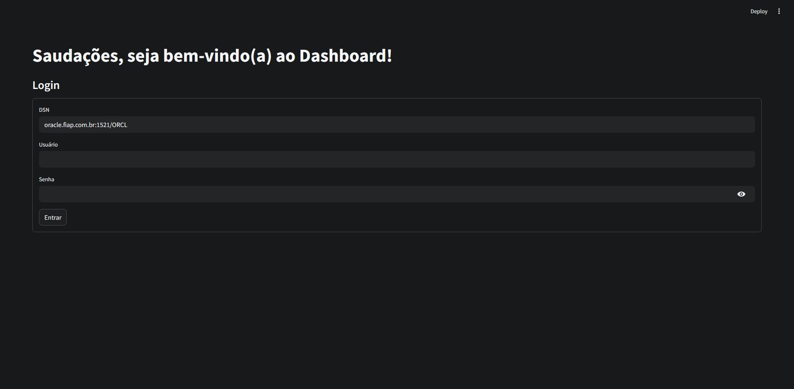
</p>

> Preencha o usuário e senha do banco de dados Oracle da FIAP para acessar o dashboard.
 
## Geração de posts para redes sociais

Ao entrar no sistema, o usuário será direcionado para a página de geração de posts, onde poderá criar posts informativos com base nos dados coletados pelos sensores e nas condições ambientais atuais.
A lógica do agente de IA está dividida em vários arquivos, que podem ser encontrados na pasta `src/large_language_model`, sendo o arquivo principal o [client.py](src/large_language_model/client.py)

<p align="center">
  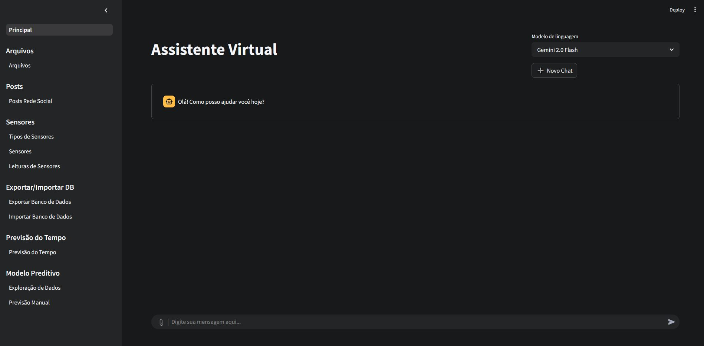
</p>

O usuário poderá interagir normalmente com o assistente virtual, que irá gerar posts informativos com base no solicitado.

<p align="center">
  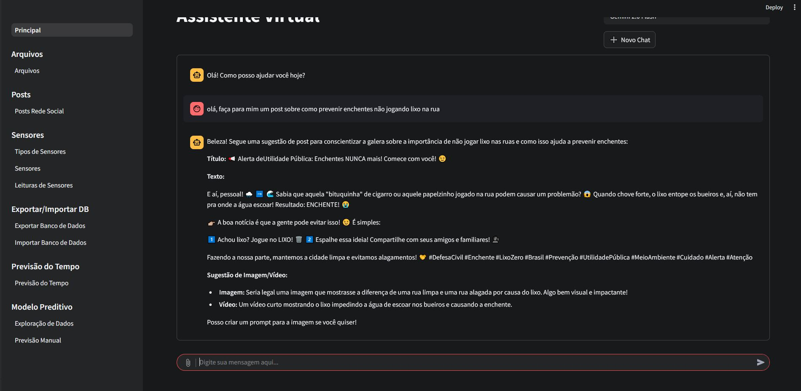
</p>

O agente também pode ser instruído a gerar e anexar imagens aos posts, com o objetivo de ilustrar as informações transmitidas e ampliar o impacto visual das mensagens de alerta.

<p align="center">
  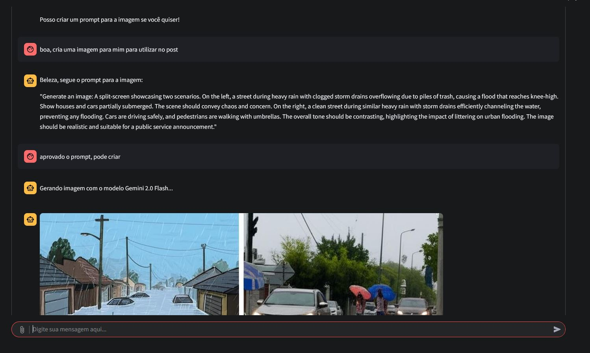
</p>
<p align="center">
  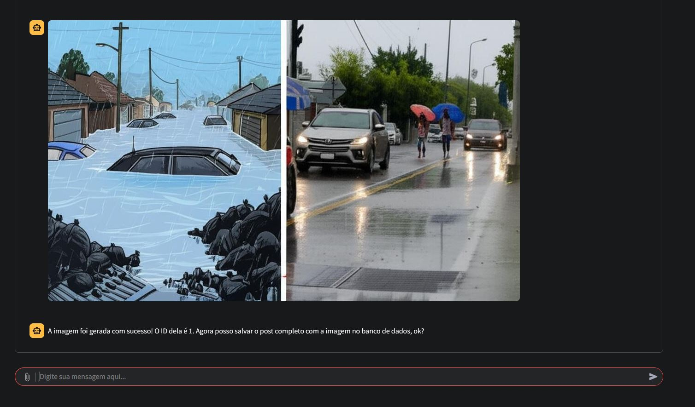
</p>

> **Nota**
> Em algumas situações, o agente pode não gerar a imagem diretamente, mas apenas sugerir o prompt de criação. Nesses casos, basta informar ao agente que o prompt está aprovado e solicitar a geração da imagem, conforme demonstrado anteriormente.

Por fim, também é possível solicitar ao agente que salve o post criado. O conteúdo será armazenado no banco de dados e poderá ser visualizado posteriormente no dashboard.

<p align="center">
  
</p>

## Previsão do tempo e de enchentes

O gente de IA também é capaz de coletar dados meteorológicos e prever condições climáticas, como enchentes, utilizando a API do OpenWeather. O usuário pode solicitar informações sobre o clima atual e previsões para os próximos dias.
A lógica utilizada para a previsão de enchentes pode ser encontrada no arquivo [realizar_previsao_func_full.py](src/modelo_preditivo/realizar_previsao_func_full.py)

<p align="center">
  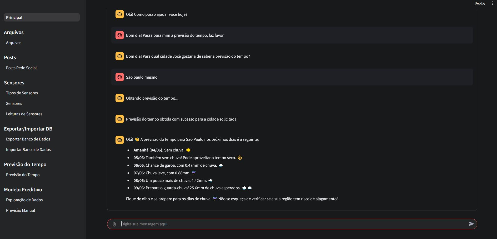
</p>

> Para obter a previsão do tempo, o agente utiliza a API do OpenWeather, que fornece dados atualizados sobre as condições climáticas em tempo real.

<p align="center">
  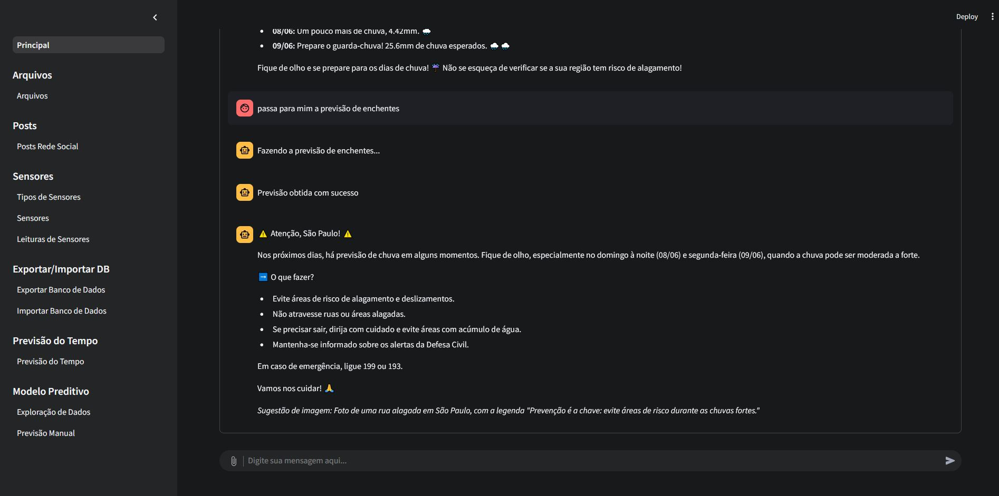
</p>

> **ATENÇÃO**
> A previsão de enchentes é baseada nas leituras dos sensores e no modelo de IA treinado pelo grupo, que será detalhado a seguir. O Agente de IA utiliza uma ferramenta (tool) que tem acesso ao modelo preditivo de enchentes e, em seguida, repassa a resposta ao usuário.

## Possíveis erros ao interagir com o agente

O projeto utiliza uma chave de API para desenvolvedores do Google, a qual pode ter limitações de uso. 
Caso o usuário encontre erros ao interagir com o agente, como mensagens de falha ou problemas na geração de posts, é possível que a chave tenha atingido o limite de requisições.
Para resolver esse problema, o usuário pode tentar novamente mais tarde ou utilizar uma chave de API própria, conforme explicado na seção "Arquivo de Configuração".
O limite de requisições da API é de 60 requisições por minuto e 1500 requisições por dia. Entretanto, os modelos podem ficar indisponíveis ao longo do dia, dependendo do volume de usuários que estão utilizando a API.

<p align="center">
  
</p>

## Possíveis alucinações que o agente pode ter

O agente não é perfeito e pode apresentar alucinações — ou seja, gerar informações incorretas, irrelevantes ou até mesmo começar a responder em inglês.
Isso pode ocorrer devido a limitações do modelo de IA ou à forma como o prompt foi interpretado pelo agente.
Caso isso ocorra, a melhor solução é clicar no botão "Novo Chat" e iniciar uma nova conversa.

## Menus CRUD

Os menus CRUD são criados de maneira automatizada a partir dos Models citados anteriormente. A lógica de sua criação pode ser encontrada na pasta `src/dashboard/generic`, como por exemplo o arquivo [table_view.py](src/dashboard/generic/table_view.py).

## Visualizando e alterando imagens criadas

As imagens geradas pelo agente de IA podem ser visualizadas e editadas diretamente no dashboard. O usuário pode acessar a página de Arquivos, onde poderá visualizar todas as imagens criadas, além de editar ou excluir aquelas que não forem mais necessárias.


<p align="center">
  
</p>
<p align="center">
  
</p>
<p align="center">
  
</p>

Para salvar um novo arquivo, o usuário pode clicar no botão "Novo", preencher o formulário e clicar em "Salvar". O arquivo será adicionado à lista de arquivos e poderá ser utilizado posteriormente na criação de posts.

<p align="center">
  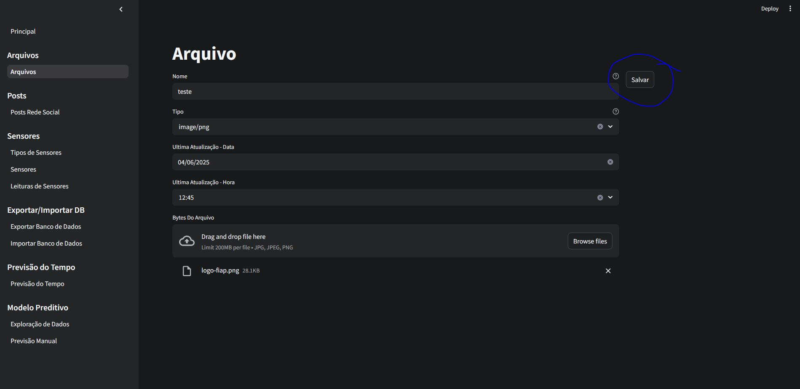
</p>

Para editar um arquivo existente, o usuário pode selecionar um arquivo da lista e clicar no botão "Editar", fazer as alterações necessárias e clicar em "Salvar". O arquivo será atualizado na lista de arquivos.

<p align="center">
  
</p>
<p align="center">
  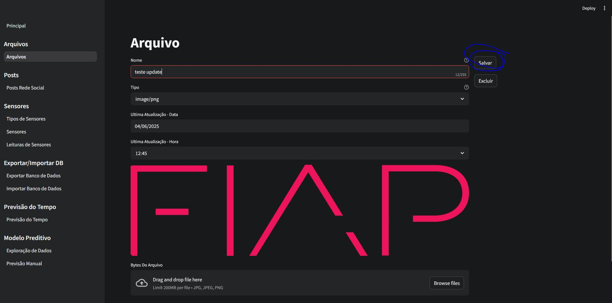
</p>
<p align="center">
  
</p>

Para excluir um arquivo, o usuário pode selecionar um arquivo da lista e clicar no botão "Editar" e posteriormente "Excluir". O arquivo será removido da lista de arquivos.

<p align="center">
  
</p>
<p align="center">
  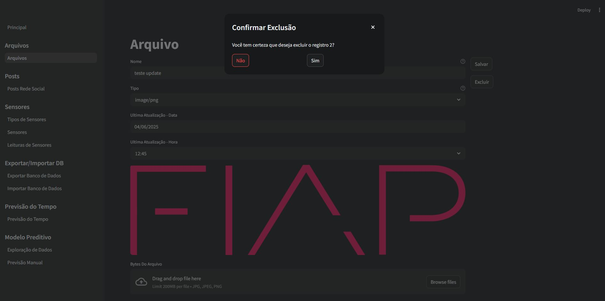
</p>
<p align="center">
  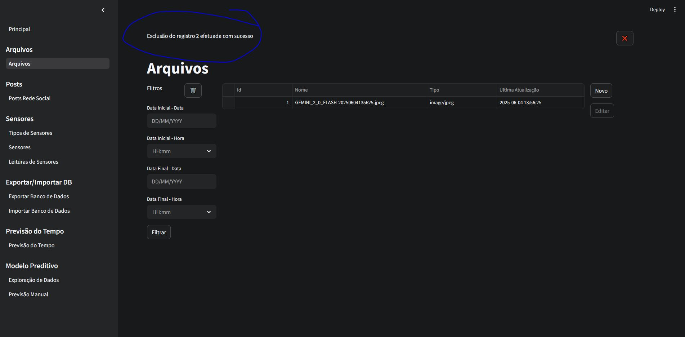
</p>

## Visualizando e alterando posts criados

A lógica de visualização e alteração dos posts criados segue a mesma estrutura utilizada para os arquivos. O usuário pode acessar a página "Posts", onde é possível visualizar todos os conteúdos previamente gerados, além de realizar ações como edição ou exclusão daqueles que não forem mais necessários.
Posto isto, seguem abaixo algumas imagens que ilustram a interface da página de posts, incluindo as funcionalidades de visualização e edição dos conteúdos criados.

<p align="center">
  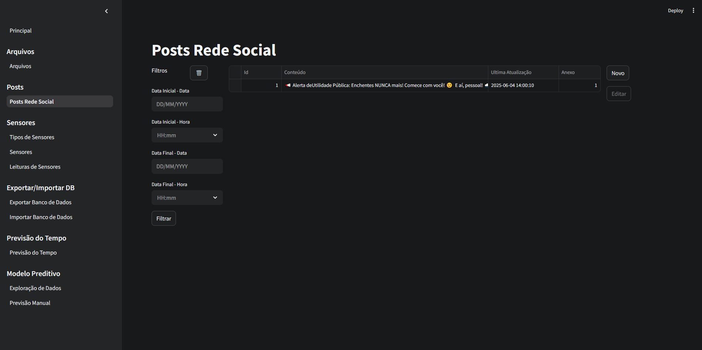
</p>
<p align="center">
  
</p>
<p align="center">
  
</p>

## Visualizando e alterando sensores e leituras

Os sensores podem ser localizados no menu sob a sessão de sensores, nele o usuário poderá visualizar todos os sensores cadastrados, bem como as leituras realizadas por cada um deles.
O usuario também poderá realizar operações CRUD na mesma maneira do anteriormente citado.

<p align="center">
  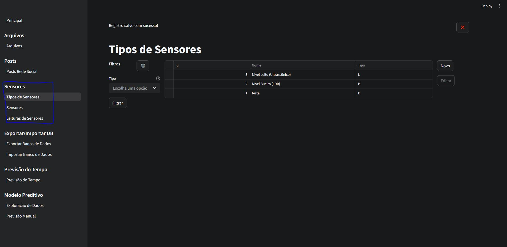
</p>
<p align="center">
  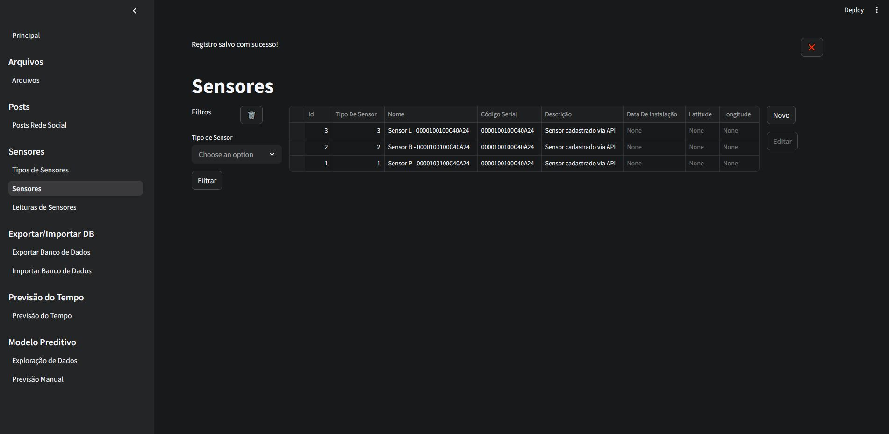
</p>
<p align="center">
  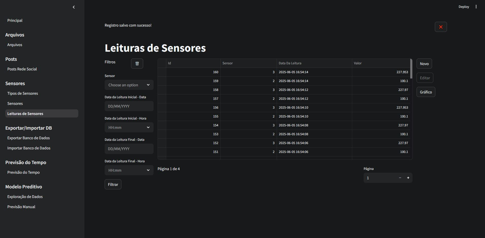
</p>

No caso das leituras, o usuário poderá visualizar um gráfico com as leituras realizadas por cada sensor, podendo visualizar um gráfico com dados reais ou simulados.

<p align="center">
  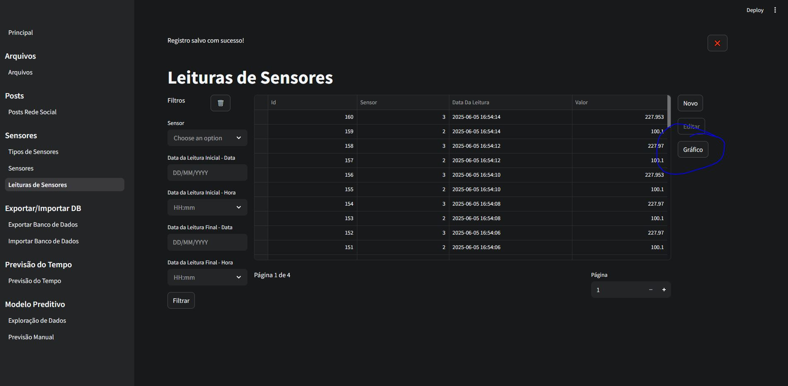
</p>
<p align="center">
  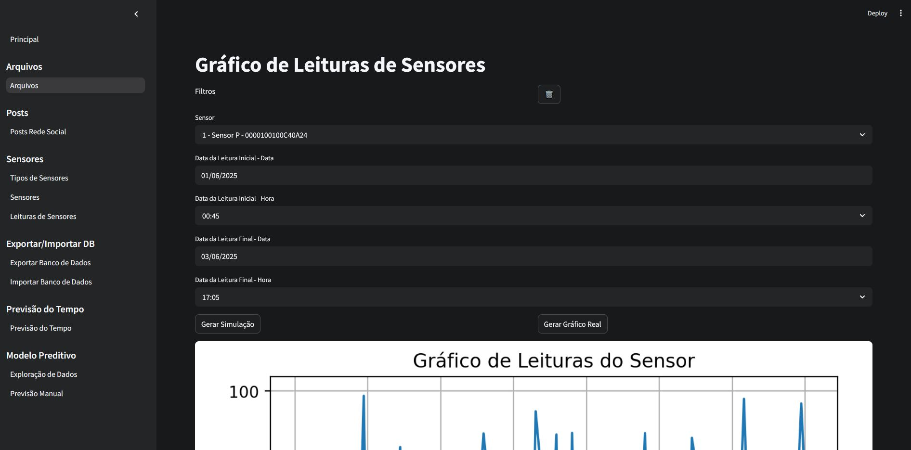
</p>
<p align="center">
  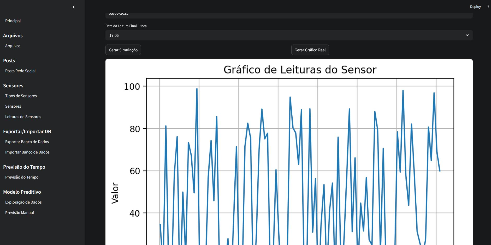
</p>

## Importar Tabelas com os dados

As tabelas com os dados utilizados no sistema podem ser encontradas na pasta em `assets/database_export.zip`.

O arquivo zip contém os arquivos no formato CSV, que podem ser importados para o banco de dados utilizando o dashboard, conforme passos abaixo.

1. O usuário deve selecionar a opção "Importar Banco de Dados" no menu principal.
<p align="center">
  
</p>

2. Selecione o arquivo ZIP localizado em `assets/database_export.zip`, espere carregar, role a página até o final e clique no botão "Salvar no Banco de Dados".
<p align="center">
  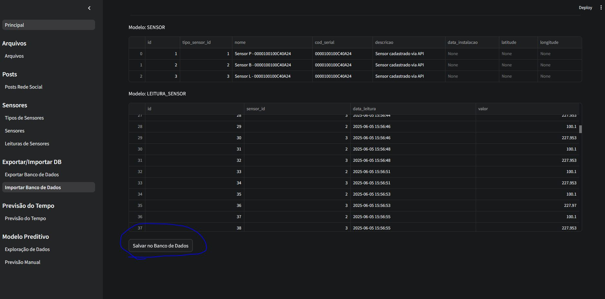
</p>

3. Não feche a janela e espere a operação ser concluída. Após a conclusão, o sistema irá exibir uma mensagem de sucesso. Caso ocorra algum erro, tente novamente.

<p align="center">
  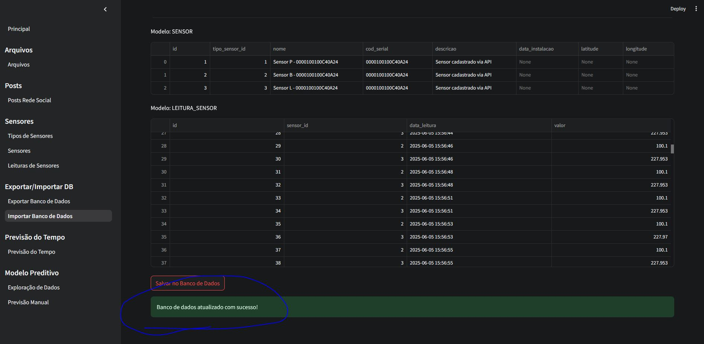
</p>


## Previsão do tempo

O usuario também pode acessar a página de Previsão do Tempo, onde poderá visualizar as condições climáticas atuais e as previsões para os próximos dias.

<p align="center">
  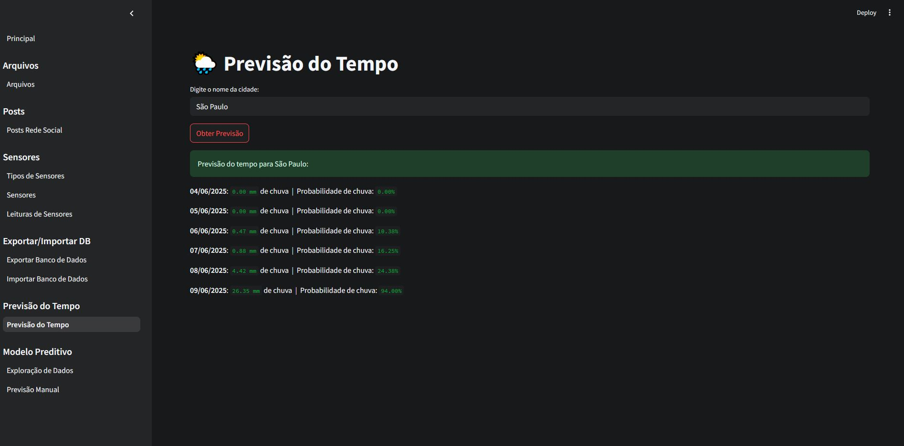
</p>

## Modelo de IA para a previsão de enchentes

O tema escolhido pelo grupo para o desenvolvimento do modelo de Inteligência Artificial foi a previsão de enchentes, considerando que este é um dos desastres naturais mais recorrentes no Brasil, com alto potencial de causar danos significativos à população.

O agente de IA possui acesso direto ao modelo preditivo treinado pelo grupo, o qual foi desenvolvido com base em dados reais provenientes da Agência Nacional de Águas e Saneamento Básico (ANA). Os dados utilizados referem-se a séries históricas de níveis e vazões de estações hidrológicas em todo o país, e estão disponíveis publicamente no repositório oficial da ANA, acessível por meio do seguinte link:

🔗 https://github.com/anagovbr/hidro-dados-estacoes-convencionais

Para mais informações sobre a origem e confiabilidade da base de dados, pode-se consultar a publicação oficial da Agência Brasil:

📄 https://agenciagov.ebc.com.br/noticias/202310/agencia-disponibiliza-series-historicas-de-dados-de-niveis-e-vazoes-de-estacoes-em-todo-o-pais 

Para realizar a previsão, o modelo utiliza as leituras mais recentes dos sensores de nível de água e das condições ambientais da região. Com base nessas informações, ele estima a probabilidade de ocorrência de enchentes em determinado local.

Além da integração com o agente, o usuário também pode realizar previsões diretamente por meio do dashboard interativo.

A seguir, apresenta-se a visualização exploratória da base de dados utilizada no treinamento do modelo de IA.

<p align="center">
  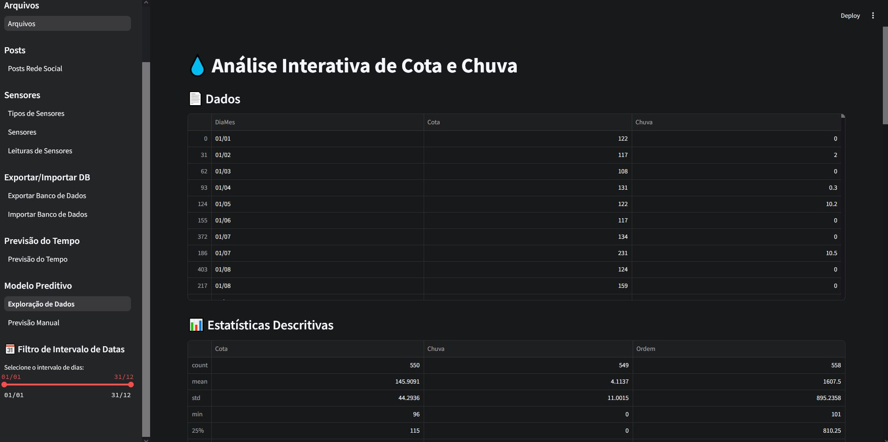
</p>
<p align="center">
  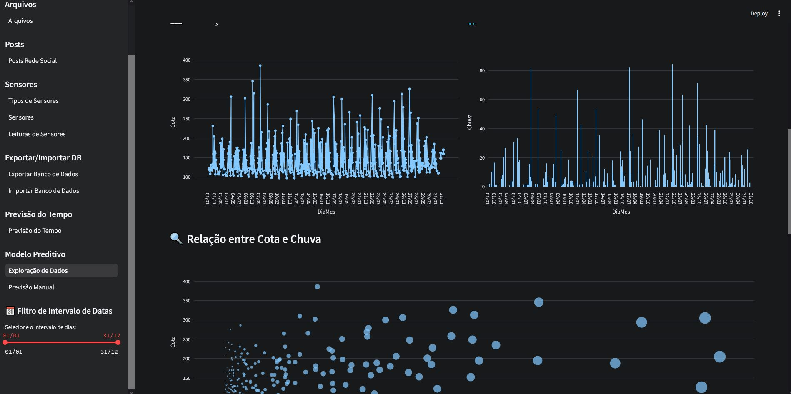
</p>
<p align="center">
  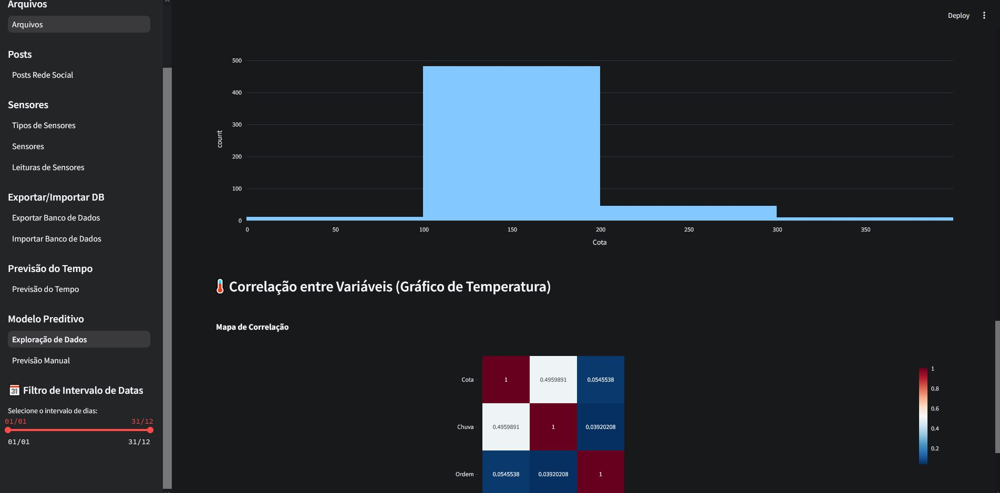
</p>

Por fim, a view onde o usuário pode realizar a previsão de enchentes, que utiliza o modelo de IA treinado pelo grupo.

<p align="center">
  
</p>


## ⚙️ Treinamento do Modelo de Previsão [treinamento_modelo.py](src/modelo_preditivo/treinamento_modelo.py)

A construção do modelo de machine learning iniciou-se com a **importação das bibliotecas necessárias** para todas as fases de análise: desde a **leitura e manipulação de tabelas** (usando **pandas** e **numpy**), passando pela **visualização preliminar de dados** (com **matplotlib** e **seaborn**), até o **pré-processamento e a modelagem em si** (com classes de scikit-learn como **StandardScaler**, **LabelEncoder**, **OneHotEncoder**, **StratifiedKFold** e diversos classificadores). Também trouxemos utilitários como **joblib** para **salvar artefatos** (modelos, scalers e label encoders) e módulos padrão como **random**, **time** e **os** para **controle de aleatoriedade**, **medição de tempo** e **manipulação de arquivos**.

Logo após agrupar todas essas importações, definimos o caminho para o arquivo CSV que armazena as medições de **“Cota”** (nível da água), **“Chuva”** e **“Data”** — esse arquivo recebeu o nome de [COTAxCHUVA.csv](src/modelo_preditivo/COTAxCHUVA.csv) e é carregado em um **DataFrame** (padrão do pandas) para facilitar a exploração e o tratamento. A partir daí, começamos a **entender a distribuição da variável “Cota”**: calculamos os **percentis 90**, **95** e **98** (P90, P95 e P98). Esses valores serviram de referência para delimitar **três faixas críticas** que depois se tornariam **rótulos de “nível de inundação”**:

- Qualquer cota acima de **P98** foi classificada como **“Inundação provável”**.  
- Valores entre **P95 e P98** configuraram o rótulo **“Alerta elevado”**.  
- Aqueles entre **P90 e P95** passaram a ser **“Situação de atenção”**.  
- Todos os pontos abaixo de **P90** ficaram em **“Condições normais”**.

Com esses limites em mãos (definidos no código como **315**, **250** e **205**, respectivamente), implementamos a função **classificar_nivel(cota)** que, para cada valor de cota, retornava um dos quatro rótulos mencionados. Aplicamos essa função diretamente ao **DataFrame**, criando a coluna **Nivel**, que se tornou nossa **variável alvo** para o problema de classificação.

Em seguida, conduziu-se uma **inspeção inicial**: exibimos as primeiras linhas com **df.head()** e consultamos a estrutura de tipos e presença de valores nulos com **df.info()**. Para garantir que nenhum dado faltante interrompesse a modelagem, executamos **df.isnull().sum()** e usamos interpolação pelo método **“nearest”** para preencher eventuais **NaNs**. Assim que confirmamos que não havia mais valores ausentes, identificamos registros duplicados com **df.duplicated().sum()**, exibimos quantos existiam (no notebook original apenas imprimimos esse total) e pudemos optar por remover ou manter duplicatas conforme o contexto. A seguir, avaliamos a presença de **outliers** em **“Cota”** e **“Chuva”** definindo **limites lógicos** (por exemplo, **“Cota”** entre **50 e 500**; **“Chuva”** entre **0 e 300**). Ao filtrar pontos fora desses intervalos, conseguimos visualizar quantas amostras estavam fora do padrão e, se necessário, tratá-las antes da modelagem. Para complementar, exibimos as estatísticas descritivas básicas do conjunto com **df.describe()**, conferindo **média**, **mediana**, **desvio padrão** e **quartis** para as variáveis numéricas.

Quando chegamos à coluna **Nivel**, vimos quantas instâncias havia em cada categoria por meio de **df['Nivel'].value_counts()**. Esse passo é importante para detectar **desequilíbrio entre classes** — por exemplo, se a maioria dos registros se concentrasse em **“Condições normais”** e houvesse poucas amostras em **“Inundação provável”**. Caso o desbalanceamento fosse muito grave, consideraríamos técnicas como **oversampling** ou **undersampling**, mas nesse caso inicial seguimos sem ajustes extras.

Chegou o momento de **separar variáveis preditoras de variável alvo**: descartamos a coluna **Nivel** de nosso conjunto **X**, restando apenas **“Cota”** e **“Chuva”** (e, caso necessário, engenharias de atributos de data). A variável **y** passou a ser **df['Nivel']**. Para que os classificadores entendessem os rótulos, aplicamos o **LabelEncoder**, convertendo as categorias de texto em números (por exemplo, **“Condições normais”** → **0**, **“Situação de atenção”** → **1**, etc.). O **DataFrame** foi atualizado com a nova coluna numérica, substituindo os nomes de rótulo pela versão codificada.

Com **X e y ajustados**, dividimos o dataset em **conjuntos de treinamento e teste** na proporção de **80/20**, utilizando **train_test_split(..., stratify=y)**. A estratificação garantiu que a proporção de exemplos de cada classe se mantivesse aproximadamente igual em ambos os conjuntos, o que evita que um modelo seja treinado sem nenhuma instância de **“Inundação provável”**, por exemplo.

Antes de alimentar os classificadores, aplicamos o **MinMaxScaler** em **X_train** e **X_test** para que todas as variáveis ficassem no intervalo de **0 a 1** — essencial para algoritmos sensíveis à escala, como **KNN** e **SVM**. Depois desse escalonamento, garantimos que **y_train** e **y_test** fossem estruturas unidimensionais de inteiros.

Para avaliar de forma justa cada modelo, construímos um esquema de **validação cruzada estratificada** com **5 folds** (**StratifiedKFold(n_splits=5, shuffle=True, random_state=42)**). Esse procedimento divide repetidamente o conjunto de treinamento em cinco partes, treinando e validando em combinações diferentes para obter uma média mais robusta de desempenho.

A parte de **instanciação dos modelos** é bastante ampla: geramos aleatoriamente variações de hiperparâmetros para cerca de **20 classificadores diferentes**, incluindo **Regressão Logística**, **Árvores de Decisão**, **Random Forest**, **Gradient Boosting**, **ExtraTrees**, **AdaBoost**, **Bagging** (com base em **Decision Tree**), **SVM** (com kernels variados), **KNN** (com diferentes k), **Naive Bayes**, **MLP** (com arquiteturas distintas), **LDA**, **QDA** e modelos calibrados via **CalibratedClassifierCV**. Para cada modelo, criamos um nome único que incorpora seus hiperparâmetros (por exemplo, **“RandForest 150”** ou **“SVM rbf”**), evitando repetições de instâncias e garantindo que pudéssemos comparar configurações distintas em um único experimento.

O **laço de treinamento** percorre essa lista de tuplas (nome, modelo). Para cada par, registramos o horário de início, chamamos **modelo.fit(X_train, y_train)** e, logo em seguida, usamos **modelo.predict(X_test)** para gerar as predições no conjunto de teste. Também tentamos obter **probabilidades de predição** (**predict_proba**) para calcular o **ROC AUC** — no caso de problemas binários, usamos a probabilidade da classe positiva; em multiclasse, aplicamos o modo **“one-vs-rest”**. Se o método **predict_proba** não fosse suportado, atribuíamos **None** para a métrica **AUC**. O **tempo total de treinamento** (em segundos) foi calculado subtraindo o tempo de término menos o tempo de início.

Depois de treinar e avaliar cada modelo, guardamos em um dicionário uma linha contendo as métricas:

- **Accuracy** (acurácia simples)  
- **Precision** (média ponderada, com **zero_division=0**)  
- **Recall** (média ponderada)  
- **F1 Score** (média ponderada)  
- **ROC AUC** (onde disponível)

Registramos o **tempo de treinamento** em uma lista separada, construindo posteriormente o **DataFrame df_tempos** com cada par (**nome do modelo**, **tempo em segundos**).

Após concluir o ciclo para todos os modelos, transformamos a lista de resultados em um DataFrame chamado **atual_resultados**, ordenando-o de forma decrescente por **F1 Score**. Consequentemente, **atual_resultados** exibe um **ranking completo** de todos os **20 modelos** testados, das **melhores** às **piores performances**. Paralelamente, montamos **df_tempos** para comparar visualmente a eficiência no treinamento.

Para gerar as **visualizações comparativas**, implementamos a função **exibir_metricas(df_resultados, df_tempos)**. Nela, construímos três gráficos:

- **Barplot de F1 Score** para todos os modelos, onde cada barra apresenta o valor do F1 Score obtido no teste.  
- **Heatmap** com o conjunto de métricas (**acurácia**, **precisão**, **recall**, **F1 Score** e **ROC AUC**) para todos os modelos, facilitando a análise de trade-offs entre diferentes desempenhos.  
- **Barplot de tempo de treinamento** por modelo, demonstrando o custo computacional associado a cada algoritmo e configuração.

Assim, conseguimos visualizar de forma clara quais modelos não só apresentam melhor equilíbrio entre **precisão** e **recall**, mas também quais exigem menos **tempo de processamento**.

Na **segunda parte do notebook**, focamos na **manutenção de um histórico dos 5 melhores modelos**. Primeiro, verificamos se já existia o arquivo **melhores_modelos.csv**. Se ele existisse, carregávamos seu conteúdo em um DataFrame, uníamos (concatenávamos) com os resultados atuais (**atual_resultados**) e, em seguida, ordenávamos tudo por **F1 Score** de forma decrescente. **Duplicatas** pelo **nome do modelo** eram removidas, de modo a manter apenas versões únicas de cada configuração. Por fim, mantínhamos os **5 primeiros registros**, salvando essa seleção novamente em **melhores_modelos.csv**.

Com os nomes dos **top 5** selecionados, criamos (caso não existisse) a pasta **modelos_salvos/** e, para cada modelo do **top 5**, geramos um arquivo **.pkl** por meio de **joblib.dump()**. Cada arquivo armazenava um dicionário com três chaves:

- **‘modelo’**: o objeto do próprio classificador treinado;  
- **‘scaler’**: o **MinMaxScaler** usado no pré-processamento;  
- **‘label_encoder’**: o **LabelEncoder** utilizado para convergir as categorias de rótulo em inteiros.

Esse passo garante que, ao recarregar um desses arquivos no futuro, teremos **tudo** o que precisamos para **replicar o pipeline de entrada** (**transformação dos atributos** e **inversão dos rótulos**).

Em seguida, reconstruímos dois DataFrames:

- **top5_resultados** contém as linhas de **atual_resultados** filtradas apenas pelos cinco modelos selecionados.  
- **top5_tempos** resulta da junção de **df_tempos** com esses cinco nomes, permitindo ordenar e exibir corretamente o **tempo de treinamento** de cada um deles.

Para esses **top 5**, geramos **três novas visualizações** específicas:

- **Barplot do F1 Score (Top 5)**, ressaltando as diferenças sutis entre as performances dos melhores modelos.  
- **Heatmap (Top 5)** contendo as métricas de cada um desses cinco, para comparação detalhada.  
- **Barplot de tempo de treinamento (Top 5)**, expondo qual modelo se mostrou mais rápido para treinar, sem abrir mão da qualidade na predição.

Por fim, imprimimos um **relatório detalhado** para cada modelo do **Top 5**. Para cada nome:

- Tentamos carregá-lo diretamente da **memória** (caso ainda estivesse em **modelos_treinados**) ou, se não estivesse, buscamos o arquivo **.pkl** em disco. Se o arquivo não fosse encontrado, avisávamos que aquele modelo específico não estava disponível para avaliação.  
- Geramos predições em **X_test** com **modelo.predict(X_test)** (caso ainda não as tivéssemos em **y_preds**) e, em seguida, comparamos **y_test_labels** e **y_pred_labels**.  
- Impressão das **métricas globais**: **Acurácia**, **Precisão (weighted)**, **Revocação (weighted)** e **F1 Score (weighted)**.  
- Exibição do **“classification_report”** completo, apresentando **precisão**, **recall** e **f1-score** por classe.

Dessa maneira, este detalhamento textual pode ser incorporado ao **README** de sua aplicação, oferecendo uma **visão completa e passo a passo** de como o **modelo de previsão** foi construído, avaliado e salvo.


## 📁 Estrutura de pastas

Dentre os arquivos e pastas presentes na raiz do projeto, definem-se:

- <b>.streamlit</b>: Pasta que contém arquivos de configuração do Streamlit, como o tema da interface e a organização da barra lateral.
- <b>assets</b>: Diretório destinado ao armazenamento de elementos não estruturados do projeto, como imagens e ícones utilizados no dashboard.
- <b>src</b>: Diretório principal que contém todo o código-fonte desenvolvido ao longo das fases do projeto. Ele está organizado nos seguintes submódulos:
  - <b>api_metereologica</b>: Contém o código responsável por interagir com a API pública de previsão do tempo, coletando dados meteorológicos externos. ([api_metereologica](src/api_metereologica/))
  - <b>dashboard</b>: Código responsável pela construção do dashboard, desenvolvido em Python com uso da biblioteca Streamlit. ([dashboard](src/dashboard/))
  - <b>database</b>: Módulo responsável pelas operações de banco de dados, incluindo conexões, inserções, listagens, edições e exclusões de registros.
  - <b>large_language_model</b>: Contém o código do agente de IA, que é responsável por gerar posts informativos e interagir com o usuário. Este módulo inclui a lógica de geração de posts, bem como a integração com o modelo de previsão de enchentes.
  - <b>logger</b>: Código responsável por registrar (logar) todas as operações executadas no sistema, garantindo rastreabilidade.
  - <b>modelo_preditivo</b>: Contém o código do modelo de previsão de enchentes, incluindo o treinamento do modelo e a lógica de previsão. Este módulo é responsável por analisar os dados históricos de níveis de água e condições ambientais para prever possíveis enchentes.
  - <b>plots</b>: Contém o código responsável pela geração de gráficos e visualizações, utilizado para exibir dados de forma clara e intuitiva no dashboard.
  - <b>services</b>: Contém o código responsável por serviços auxiliares.
  - <b>wokwi</b>: Contém o código do sensor ESP32 utilizado na simulação de sensores de nível de rios e condições ambientais, com foco na previsão de enchentes em regiões monitoradas.
  - <b>wokwi_api</b>: Contém o código responsável por criar a API que vai salvar as leituras dos sensores no banco de dados, permitindo a integração entre o sensor e o sistema de previsão de enchentes.
- <b>.env</b>: Arquivo de configuração que contém as chaves de API e outras variáveis de ambiente necessárias para o funcionamento do sistema. É necessário criar este arquivo na raiz do projeto, conforme orientações na seção "Arquivo de Configuração".
- <b>.gitignore</b>: Arquivo que especifica quais arquivos e pastas devem ser ignorados pelo Git, evitando que informações sensíveis ou desnecessárias sejam versionadas. É importante garantir que o arquivo `.env` esteja incluído neste arquivo para evitar o upload de chaves de API e outras informações sensíveis.
- <b>README</b>: Arquivo de documentação do projeto (este que está sendo lido), com orientações gerais, instruções de uso e contextualização.
- <b>main_dash</b>: Arquivo principal para a execução do dashboard. Está localizado na raiz do projeto com o objetivo de evitar problemas com importações de módulos internos.
- - <b>requirements.txt</b>: Arquivo que lista todas as dependências do projeto, necessário para a instalação do ambiente virtual. Deve ser utilizado com o comando `pip install -r requirements.txt` para instalar as bibliotecas necessárias.

## 🗃 Histórico de versionamento

* **0.5.0 - 06/06/2025** – README versão final  
* **0.4.0 - 05/06/2025** – Revisão completa e formalização do README:  
  - Correções gramaticais e de concordância;
  - Aprimoramento do texto para maior clareza e formalidade;
  - Documentação da instalação, execução e uso do `.env`; 
  - Explicações detalhadas sobre possíveis erros, limitações e alucinações do agente de IA;
  - Inclusão dos links oficiais da base de dados utilizada no modelo de previsão de enchentes;
  - Atualização da seção de estrutura de pastas;
  - Adição do tópico "Treinamento do Modelo de Previsão" descrevendo o processo de treinamento realizado;
  - Adição do tópico "Próximos Passos e Visão Futura" com foco na expansão para aplicativo móvel, detalhando funcionalidades planejadas para aumentar o alcance e a usabilidade do sistema.
* **0.3.0 - 05/06/2025** – Melhorias no readme, adição de imagens e explicações sobre os sensores e importação de banco de dados  
* **0.2.0 - 04/06/2025** – Versão preliminar da nossa aplicação, com dashboard e funcionalidades básicas implementadas  
* **0.1.0 - 26/06/2025** – Versão preliminar da nossa aplicação

## 📋 Licença

<p xmlns:cc="http://creativecommons.org/ns#" xmlns:dct="http://purl.org/dc/terms/"><a property="dct:title" rel="cc:attributionURL" href="https://github.com/agodoi/template">MODELO GIT FIAP</a> por <a rel="cc:attributionURL dct:creator" property="cc:attributionName" href="https://fiap.com.br">Fiap</a> está licenciado sobre <a href="http://creativecommons.org/licenses/by/4.0/?ref=chooser-v1" target="_blank" rel="license noopener noreferrer" style="display:inline-block;">Attribution 4.0 International</a>.</p>